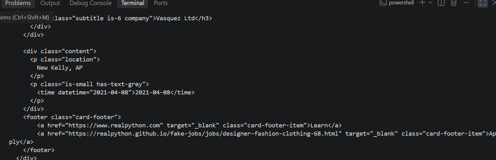
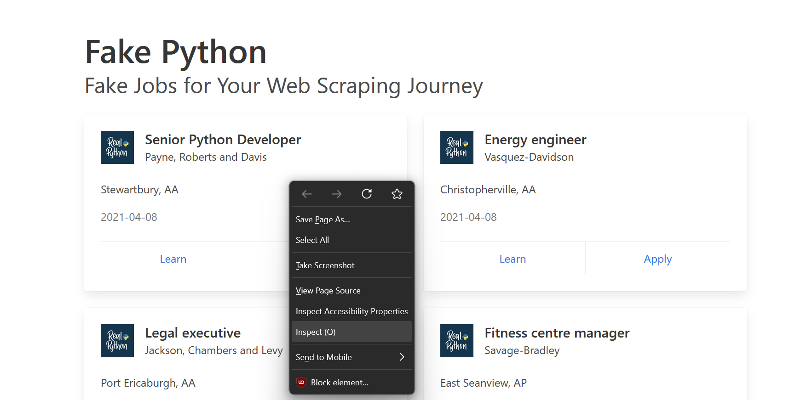
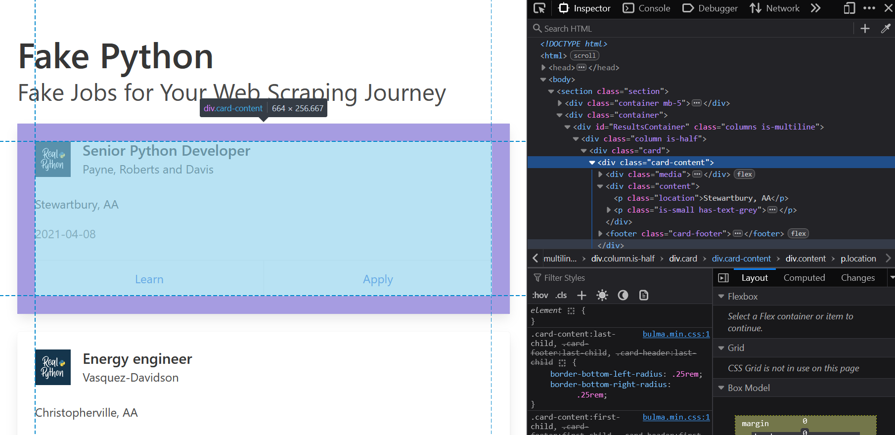
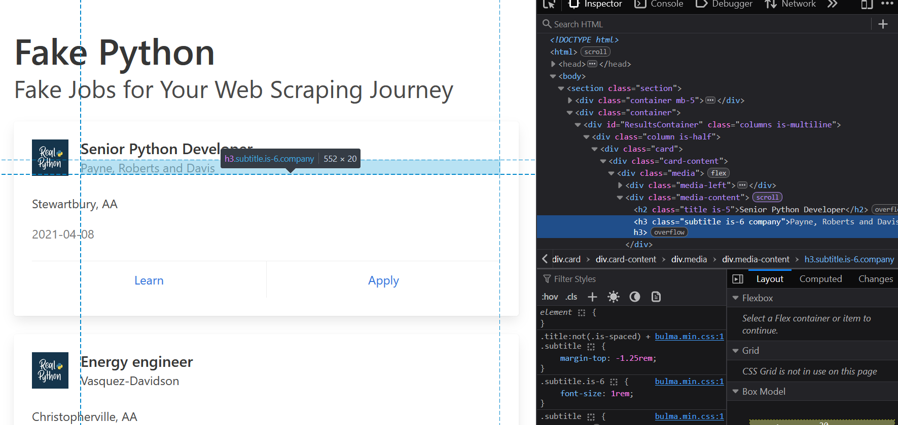

# How to make a basic web scraping programme using Beautiful Soup

 

## Project Summary
Within this tutorial i will be guiding you step-by-step on how to create a basic Web Scraping Programme using python.
The Website that we will be using in this tutorial is <https://realpython.github.io/fake-jobs/>. This website was specifically designed for learning BeautifuSoup. Every job title, company name, location and data is structured in clear, predictable HTML tags. 

So our goal is to filter out job applications under "Python", while extracting specific information from the job posting. 
Unironically using Python to find Python developer jobs. ;)

### **Step 1: Installing BeautifulSoup and using the request library to see a Websites HTML**

Firstly we need to install BeautifulSoup,requests library and lxml.

    pip install beautifulsoup4
    pip install requests
    pip install lxml

<u>Why do we need the BeautifulSoup and the request library installed?</u>

The main purpose of **BeautifulSoup** is to parse HTML and XML files so developers can easily extract, navigate and clean data from web pages, and the primary purpose of the Python **Requests library** is to send HTTP requests and interact with web resources in a simple and human-friendly way.

<u>What is the purpose of LXML and the functions of LXML?</u> 

The **LXML Library** provides python Web Scraper with an ultra fast, reliable engine to read, clean and search through HTML and XML web pages. We use it for web scraping because of its high speed, since it is written in the **C Programming Language**, this makes it much faster than pythons built in HTML parser. It fixes broken code, meaning that real world websites either have messy and broken HTML, with the LXML library it automatically repairs these errors so your scraper does not crash.

### Step 2: Using the request library to view a websites HTML

Firstly what we need to do is import **BeautifulSoup and Requests Library**
    
    import bs4 from BeautifulSoup
    import requests

Sends an HTTP GET request to the target URL using the requests library, decodes the server's response into a text string via .text, and assigns the HTML content to the html_text variable.
For testing and debugging purposes to see if the programme works, print out the variable.

    import bs4 from BeautifulSoup
    import requests

    html_text = requests.get('https://realpython.github.io/fake-jobs/').text 
    print(html_text)
After running your programme you should be able to see HTML running for a while in your terminal.

This step initializes a `BeautifulSoup` object by passing the raw HTML string (`html_text`) through the high-performance `lxml` parser engine. It converts the unstructured text into a structured document object tree stored in the `soup` variable, enabling programmatic searching, traversal, and data extraction using methods like `.find()` and `.find_all()`.

    import bs4 from BeautifulSoup
    import requests

    html_text = requests.get('https://realpython.github.io/fake-jobs/').text 
    soup = BeautifulSoup(html_text, 'lxml')

### Step 3: 

This line searches the parsed soup object for all `
` elements containing the CSS class card-content and stores them as a list in the jobs variable. By isolating these specific HTML containers, it extracts every individual job post card from the page so they can be iterated over and parsed individually in subsequent code steps, where it will be discussed in the next step of this tutorial.

    import bs4 from BeautifulSoup
    import requests

    html_text = requests.get('https://realpython.github.io/fake-jobs/').text 
    soup = BeautifulSoup(html_text, 'lxml')

    jobs = soup.find_all("div", class_ = "card-content")

In order to access this information we need to navigate onto our website 'https://realpython.github.io/fake-jobs/'.
Hover over the job posting with your mouse and right-click and inspect.

Once you have done that, navigate to the `
` element containing the CSS card-content and stores all the information as a list in the jobs variable. This information includes company name, job title, apply link and publish date. Unfortunately all the publish dates are the same, but this is still a good example for local testing and practice. 

### Step 4: iterate through job postings

We need to loop through each individual job within many jobs, hence the webpage. Like i said earlier we need to extract the company name, job title, apply link and publish date.

Within in the previous step we hovered over an empty space on the job posting (`
` element). However this time around right-click inspect the company name, job title, apply link and publish date to retreive the header and the class.

To target the "Apply" link specifically, the script navigates into the job card's `<footer>` element, where both action links reside. Because each card contains two structurally identical anchor tags, a standard search defaults to the first link ("Learn"). Using `.find_all('a')` collects all `<a>` (anchor) tags into a list, enabling zero-based indexing (`[1]`) to isolate the second element representing the "Apply" button. Finally, querying the `['href']` key extracts the Hypertext Reference attribute value, capturing the exact target URL needed for downstream parsing.

**EXAMPLE: complete this for job title and publish date**

    import bs4 from BeautifulSoup
    import requests

    html_text = requests.get('https://realpython.github.io/fake-jobs/').text 
    soup = BeautifulSoup(html_text, 'lxml')

    jobs = soup.find_all("div", class_ = "card-content")

    for job in jobs:
        company_name = job.find('h3', class_ = 'subtitle is-6 company').text
        job_title = job.find('h2', class_ = 'title is-5').text
        publish_date = job.find('p', class_ = 'is-small has-text-grey').text.strip() # strip method removes any blank spaces within a string.
        apply_link = job.footer.find_all('a')[1]['href']

### Step 5: Storing our data and writing it to a text-file

To organize our output, each job posting is saved as an individual text file in a dedicated directory (python_job_postings/). Including the trailing forward slash directs Python to write inside that specific subfolder (/).

Instead of manually tracking a loop counter, we leverage enumerate() in our loop to supply an automatic zero-based index variable.

By embedding {index}.txt directly into the relative file path inside with open(), Python dynamically names each file sequentially (0.txt, 1.txt, 2.txt, and so forth). Using the with context manager ensures each file automatically closes after writing, preventing memory leaks or corrupted files.

    for index,job in enumerate(jobs):
        company_name = job.find('h3', class_ = 'subtitle is-6 company').text
        job_title = job.find('h2', class_ = 'title is-5').text
        publish_date = job.find('p', class_ = 'is-small has-text-grey').text.strip() # strip method removes any blank spaces within a string.
        apply_link = job.footer.find_all('a')[1]['href']

        with open(f'python_job_postings/{index}.txt', 'w') as file:
            file.write(f'Company Name: {company_name} \n')
            file.write(f'Job Title: {job_title} \n')
            file.write(f'Publish Date: {publish_date} \n')
            file.write(f'Apply Link: {apply_link}')

        print(' ') # Add a space between our outputs to make it neater

### Step 6: Add a programme feature (Timer)

The last step is to wrap this block of code into a function called find_jobs(), so that we are able to call it anywhere in the source code.

This block serves as the main entry point for the script, establishing a continuous loop to automate periodic web scraping. The `if __name__ == '__main__':` guard ensures the code executes only when the script is run directly, preventing execution if it is imported into another file as a module. Inside the infinite `while True` loop, the program calls `find_jobs()` to scrape current listings, logs a status update to the console, and then uses `time.sleep(time_wait * 60)` to delay execution for 10 minutes (600 seconds) before automatically repeating the process.

    def find_jobs():
        for index,job in enumerate(jobs):
        company_name = job.find('h3', class_ = 'subtitle is-6 company').text
        job_title = job.find('h2', class_ = 'title is-5').text
        publish_date = job.find('p', class_ = 'is-small has-text-grey').text.strip() # strip method removes any blank spaces within a string.
        apply_link = job.footer.find_all('a')[1]['href']

        with open(f'python_job_postings/{index}.txt', 'w') as file:
            file.write(f'Company Name: {company_name} \n')
            file.write(f'Job Title: {job_title} \n')
            file.write(f'Publish Date: {publish_date} \n')
            file.write(f'Apply Link: {apply_link}')

        print(' ') # Add a space between our outputs to make it neater

    if __name__ == '__main__':
    while True:
        find_jobs()
        time_wait = 10
        print(f'Waiting {time_wait} minutes....')
        time.sleep(time_wait * 60)
